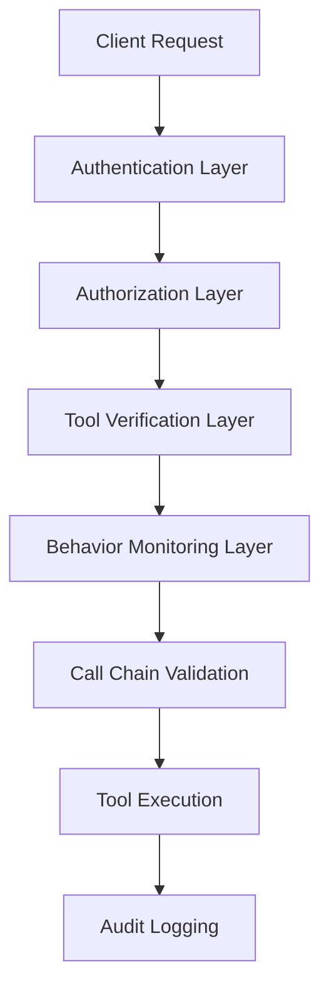

# Attack Prevention

ETDI provides comprehensive protection against various AI security threats. This section covers the major attack vectors and how ETDI prevents them.

## Overview of Threats


  
    Malicious tools impersonating legitimate ones.
  
  
  
    Legitimate tools modified to become malicious.
  
  
  
    Unauthorized tool invocation chains.
  
  
  
    Unauthorized access to higher privileges.
  


## Security Architecture

ETDI implements a multi-layered defense strategy:

## Defense Mechanisms

### 1. Cryptographic Verification
- Tool signatures using Ed25519
- Identity verification with certificates
- Tamper detection and validation

### 2. Behavioral Analysis
- Real-time behavior monitoring
- Anomaly detection algorithms
- Pattern recognition for threats

### 3. Access Control
- Role-based permissions
- Capability-based security
- Least privilege enforcement

### 4. Audit and Compliance
- Comprehensive event logging
- Forensic analysis capabilities
- Compliance reporting 