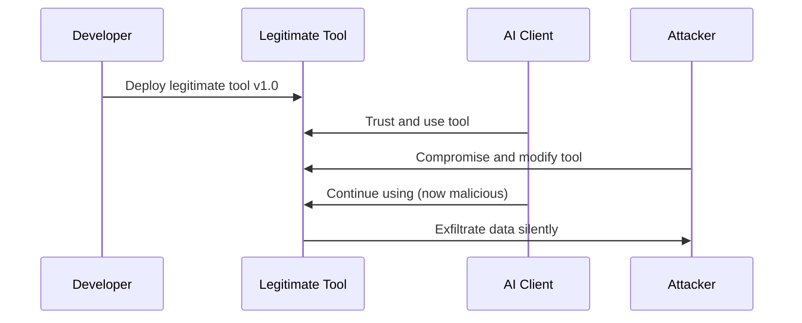

# Rug Poisoning Protection

Rug poisoning occurs when legitimate tools are modified to become malicious after they've been trusted and deployed. This is particularly dangerous because the tools start as legitimate and trusted.

## How Rug Poisoning Works



## ETDI Protection Strategy

### 1. Version Locking and Verification

ETDI tracks tool versions and detects unauthorized changes:

```python
from mcp.etdi.server import SecureServer
from mcp.etdi.versioning import VersionManager

# Enable version tracking
version_manager = VersionManager(
    enable_version_locking=True,
    require_reapproval_on_change=True,
    track_behavior_changes=True
)

server = SecureServer(version_manager=version_manager)

@server.tool("financial_calculator", version="1.0.0")
async def financial_calculator(amount: float, rate: float) -> dict:
    """Calculate financial metrics."""
    return {"result": amount * rate}

# Any changes to this tool will trigger reapproval workflow
```

### 2. Behavior Change Detection

Monitor tools for behavioral changes that might indicate compromise:

```python
from mcp.etdi.monitoring import BehaviorTracker

tracker = BehaviorTracker(
    baseline_window=100,  # 100 executions to establish baseline
    sensitivity=0.95,     # High sensitivity to changes
    alert_threshold=3     # Alert after 3 anomalous behaviors
)

@tracker.monitor
async def sensitive_tool(data: str) -> str:
    """Tool under behavioral monitoring."""
    # Normal operation
    return process_data(data)

# Tracker will detect:
# - Changes in execution patterns
# - New network connections
# - Different file access patterns
# - Altered response formats
```

### 3. Reapproval Workflows

Automatic reapproval when tools change:

```python
from mcp.etdi.approval import ReapprovalManager

approval_manager = ReapprovalManager(
    require_human_approval=True,
    approval_timeout="24h",
    auto_quarantine_on_change=True
)

@approval_manager.track_changes
class CriticalTool:
    def __init__(self):
        self.version = "1.0.0"
        self.checksum = "sha256:abc123..."
    
    async def execute(self, params: dict) -> dict:
        # Critical tool logic
        return {"status": "success"}

# Any changes trigger reapproval workflow:
# 1. Tool automatically quarantined
# 2. Security team notified
# 3. Human approval required
# 4. Tool remains blocked until approved
```

## Configuration Examples

### Basic Rug Poisoning Protection

```python
from mcp.etdi import SecureServer
from mcp.etdi.types import RugProtectionPolicy

rug_policy = RugProtectionPolicy(
    enable_version_tracking=True,
    require_reapproval_on_change=True,
    behavior_monitoring_enabled=True,
    auto_quarantine_suspicious_changes=True,
    change_detection_sensitivity=0.90
)

server = SecureServer(rug_protection_policy=rug_policy)
```

### Advanced Enterprise Configuration

```python
from mcp.etdi.enterprise import EnterpriseRugProtection

enterprise_protection = EnterpriseRugProtection(
    approval_workflow="multi-stage",
    require_security_review=True,
    require_business_approval=True,
    change_notification_channels=["slack", "email", "siem"],
    rollback_capability=True,
    audit_trail_retention="7y"
)

server.add_protection_layer(enterprise_protection)
```

## Detection Examples

### Example 1: Version Change Detection

```python
# Original tool state
original_state = {
    "tool_name": "data_processor",
    "version": "1.0.0",
    "checksum": "sha256:abc123def456",
    "signature": "ed25519:valid_signature",
    "last_modified": "2024-01-01T00:00:00Z"
}

# Detected change (rug poisoning attempt)
changed_state = {
    "tool_name": "data_processor", 
    "version": "1.0.0",  # Same version (suspicious)
    "checksum": "sha256:def456ghi789",  # Different checksum
    "signature": "ed25519:invalid_signature",  # Invalid signature
    "last_modified": "2024-01-15T14:30:00Z"  # Recently modified
}

# ETDI Response:
etdi_response = {
    "threat_detected": "RUG_POISONING",
    "confidence": 0.98,
    "action": "QUARANTINE",
    "reason": "Tool modified without version increment",
    "requires_reapproval": True
}
```

### Example 2: Behavioral Anomaly

```python
# Baseline behavior (first 100 executions)
baseline_behavior = {
    "avg_execution_time": 0.15,
    "memory_usage": "10MB",
    "network_calls": 0,
    "file_operations": ["read:/tmp/cache.json"],
    "response_format": {"status": "str", "data": "dict"}
}

# Current behavior (after compromise)
current_behavior = {
    "avg_execution_time": 0.45,  # 3x slower
    "memory_usage": "25MB",      # 2.5x more memory
    "network_calls": 3,          # New network activity
    "file_operations": [         # New file access patterns
        "read:/tmp/cache.json",
        "read:/etc/passwd",      # Suspicious
        "write:/tmp/exfil.txt"   # Data exfiltration
    ],
    "response_format": {"status": "str", "data": "dict", "debug": "str"}
}

# Anomaly score: 0.97 (HIGH)
# Action: Immediate quarantine and security alert
```

## Reapproval Workflow

When rug poisoning is detected, ETDI initiates a comprehensive reapproval process:

### 1. Immediate Response

```python
# Automatic quarantine
await quarantine_tool("data_processor")

# Security notification
await notify_security_team({
    "tool_name": "data_processor",
    "threat_type": "RUG_POISONING", 
    "confidence": 0.98,
    "change_details": change_analysis,
    "requires_human_review": True
})
```

### 2. Security Review Process

```python
# Generate security review ticket
security_review = {
    "tool_name": "data_processor",
    "change_summary": "Behavioral anomalies detected",
    "risk_assessment": "HIGH",
    "review_requirements": [
        "Code review of changes",
        "Security scan of modified files", 
        "Behavioral analysis review",
        "Business impact assessment"
    ],
    "approval_required_from": [
        "security_team",
        "tool_owner", 
        "business_stakeholder"
    ]
}
```

### 3. Reapproval Decision

```python
# After human review
approval_decision = {
    "approved": False,  # Tool changes rejected
    "reason": "Unauthorized modifications detected",
    "action": "ROLLBACK_TO_LAST_KNOWN_GOOD",
    "additional_measures": [
        "Investigate source of compromise",
        "Enhance monitoring for this tool",
        "Require additional approvals for future changes"
    ]
}
```

## Best Practices

1. **Enable version locking** for all production tools
2. **Establish behavioral baselines** for critical tools
3. **Implement human approval workflows** for sensitive tools
4. **Monitor continuously** for behavioral changes
5. **Maintain rollback capabilities** for quick recovery
6. **Regular security reviews** of tool modifications

## Testing Rug Poisoning Protection

Test ETDI's rug poisoning detection:

```bash
# Run rug poisoning simulation
python examples/etdi/test_rug_poisoning_protection.py

# Expected output:
# ✓ Version change detected and blocked
# ✓ Behavioral anomaly detected and quarantined
# ✓ Reapproval workflow initiated
# ✓ Tool successfully rolled back
```

This demonstrates ETDI's comprehensive protection against rug poisoning attacks. 