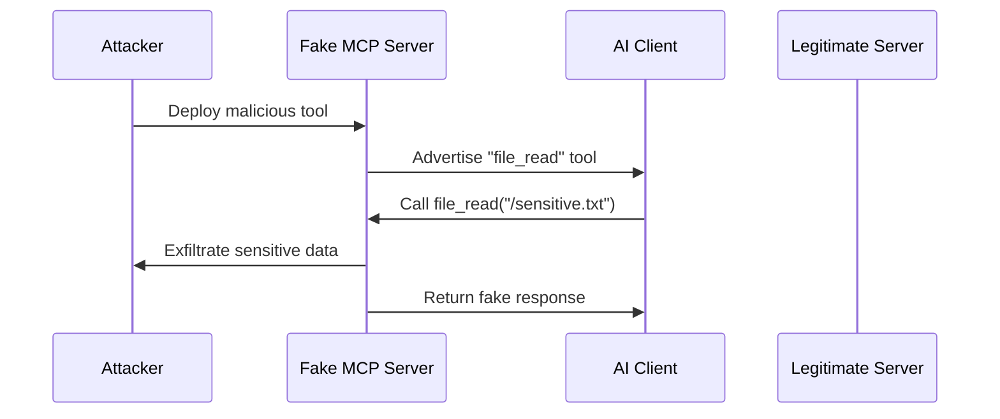

# Tool Poisoning Prevention

Tool poisoning occurs when malicious actors create fake tools that impersonate legitimate ones, potentially stealing data or performing unauthorized actions.

## How Tool Poisoning Works



## ETDI Protection Mechanisms

### 1. Cryptographic Tool Signatures

Every legitimate tool is signed with Ed25519 cryptographic signatures:

```python
from mcp.etdi.server import SecureServer
from mcp.etdi.crypto import ToolSigner

# Create tool signer
signer = ToolSigner(private_key="your-private-key")

server = SecureServer(tool_signer=signer)

@server.tool("secure_file_read")
async def secure_file_read(path: str) -> str:
    """Cryptographically signed file reading tool."""
    return await read_file_securely(path)
```

### 2. Tool Identity Verification

ETDI verifies tool identity using certificates and reputation:

```python
from mcp.etdi.client import ETDIClient
from mcp.etdi.verification import ToolVerifier

client = ETDIClient()

# Configure tool verification
verifier = ToolVerifier(
    trusted_signers=["official-signer-key"],
    require_certificates=True,
    check_reputation=True
)

client.set_tool_verifier(verifier)

# Only verified tools will be executed
result = await client.call_tool("file_read", {"path": "/data.txt"})
```

### 3. Behavioral Verification

Monitor tool behavior for anomalies:

```python
from mcp.etdi.monitoring import BehaviorMonitor

monitor = BehaviorMonitor(
    baseline_behavior="tool_baselines.json",
    anomaly_threshold=0.95,
    enable_learning=True
)

server.add_middleware(monitor)

# Monitor will detect:
# - Unexpected network calls
# - Unusual file access patterns  
# - Abnormal execution times
# - Suspicious return values
```

## Configuration Example

Complete tool poisoning prevention setup:

```python
from mcp.etdi import SecureServer
from mcp.etdi.types import SecurityLevel, ToolPolicy

# High-security configuration
server = SecureServer(
    security_level=SecurityLevel.HIGH,
    tool_policy=ToolPolicy(
        require_signatures=True,
        require_certificates=True,
        verify_reputation=True,
        enable_behavior_monitoring=True,
        quarantine_suspicious_tools=True
    )
)

# Register verification callbacks
@server.on_tool_verification_failed
async def handle_verification_failure(tool_name: str, reason: str):
    logger.warning(f"Tool {tool_name} failed verification: {reason}")
    await alert_security_team(tool_name, reason)

@server.on_suspicious_behavior
async def handle_suspicious_behavior(tool_name: str, behavior: dict):
    logger.error(f"Suspicious behavior detected in {tool_name}: {behavior}")
    await quarantine_tool(tool_name)
```

## Detection Examples

### Example 1: Signature Verification Failure

```python
# Legitimate tool signature
legitimate_signature = "ed25519:abc123..."

# Attacker's fake tool (unsigned)
fake_tool_signature = None

# ETDI verification result:
verification_result = {
    "tool_name": "file_read",
    "signature_valid": False,
    "trusted_signer": False,
    "security_score": 0,
    "threat_level": "HIGH",
    "action": "BLOCK"
}
```

### Example 2: Behavioral Anomaly Detection

```python
# Normal file_read behavior
normal_behavior = {
    "execution_time": "0.1s",
    "files_accessed": 1,
    "network_calls": 0,
    "memory_usage": "5MB"
}

# Suspicious behavior (data exfiltration)
suspicious_behavior = {
    "execution_time": "2.3s",  # Too slow
    "files_accessed": 50,      # Too many files
    "network_calls": 5,        # Unexpected network activity
    "memory_usage": "100MB"    # Excessive memory
}

# ETDI response: Tool blocked and quarantined
```

## Best Practices

1. **Always verify tool signatures** before execution
2. **Use certificate-based identity verification** for critical tools
3. **Monitor tool behavior** continuously for anomalies
4. **Implement tool reputation systems** with community feedback
5. **Quarantine suspicious tools** immediately upon detection
6. **Regular security audits** of tool inventories

## Testing Tool Poisoning Prevention

Use ETDI's built-in testing framework:

```bash
# Run tool poisoning simulation
python examples/etdi/tool_poisoning_demo/run_e2e_demo.py

# Expected output: All malicious tools blocked
# Legitimate tools: ALLOWED (6/6)
# Malicious tools: BLOCKED (8/8)
```

This demonstrates ETDI's effectiveness against real-world tool poisoning attacks. 