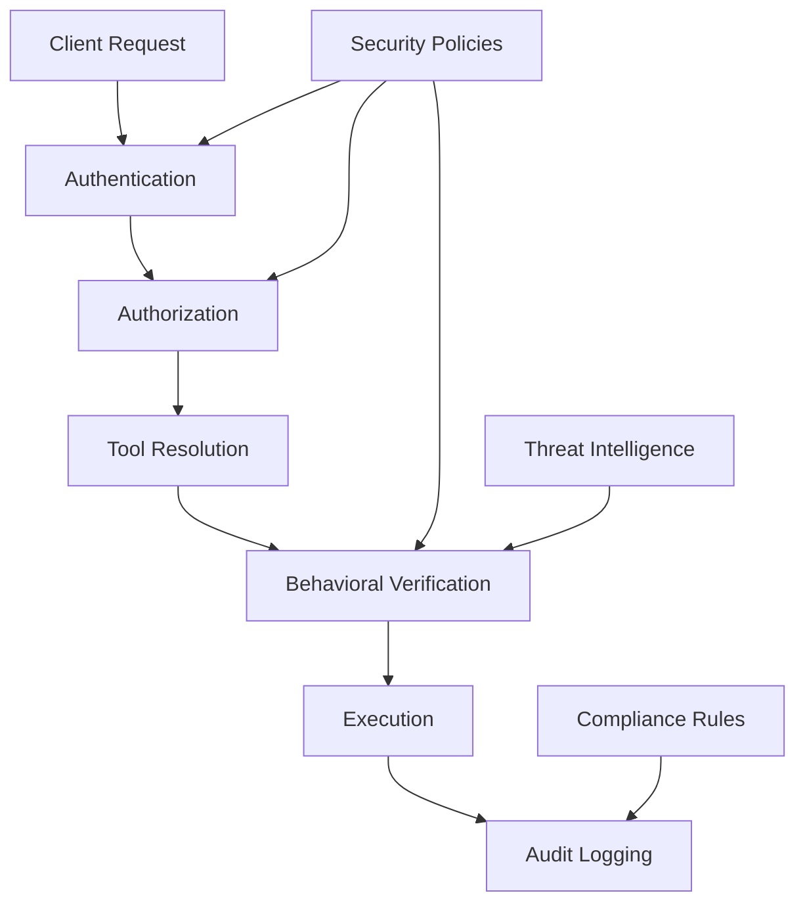

# Security Features

ETDI provides comprehensive security features to protect AI tool interactions. This section covers authentication, authorization, behavioral verification, and audit capabilities.

## Core Security Components


  
    OAuth 2.0, SAML, and enterprise SSO integration.
  
  
  
    Role-based access control and capability management.
  
  
  
    Real-time monitoring and anomaly detection.
  
  
  
    Comprehensive logging and compliance reporting.
  


## Security Architecture



## Security Levels

ETDI supports multiple security levels:

### LOW Security
- Basic authentication
- Simple tool verification
- Minimal auditing

### MEDIUM Security  
- OAuth authentication
- Role-based authorization
- Behavioral monitoring
- Standard audit logging

### HIGH Security
- Multi-factor authentication
- Capability-based access control
- Real-time behavioral analysis
- Comprehensive audit trails
- Threat intelligence integration

### MAXIMUM Security
- Zero-trust architecture
- Continuous verification
- AI-powered threat detection
- Forensic-grade audit logging
- Real-time security response

## Quick Configuration

```python
from mcp.etdi import SecureServer
from mcp.etdi.types import SecurityLevel

# Configure security level
server = SecureServer(
    security_level=SecurityLevel.HIGH,
    enable_mfa=True,
    enable_behavioral_monitoring=True,
    enable_threat_intelligence=True
)
``` 